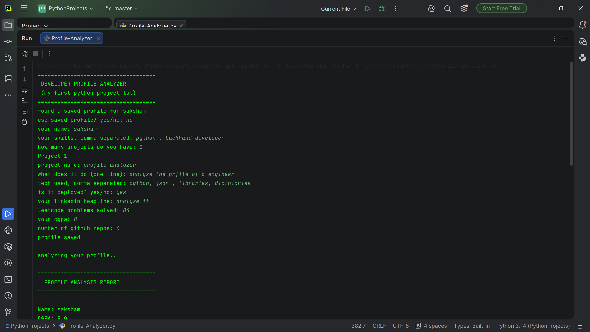
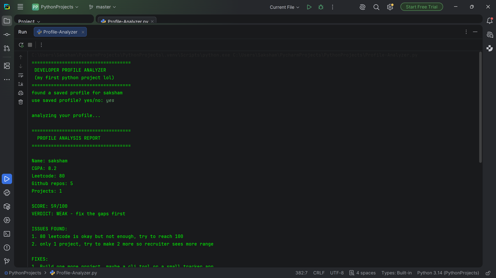
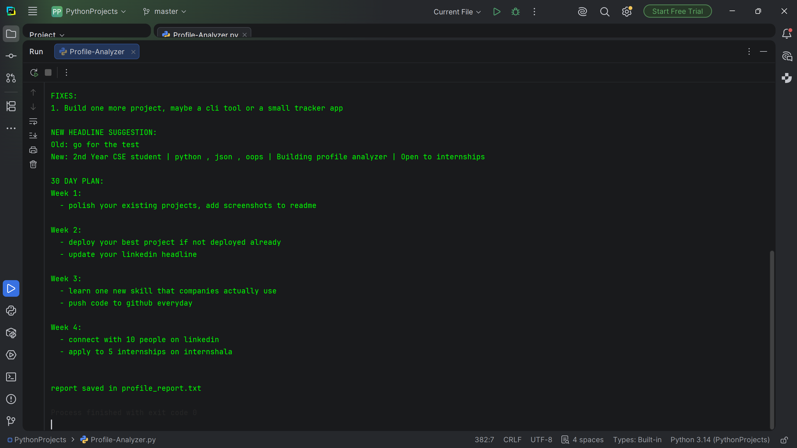

# Developer Profile Analyzer

A Python CLI tool that takes in a developer's profile details (skills, projects, LeetCode count, CGPA, GitHub repos, etc.), analyzes them, and generates a score with a personalized improvement report — including suggested LinkedIn headline and a 30-day action plan.

## Features
- Save and reuse developer profiles (JSON-based)
- Auto-generates a profile analysis report with score and verdict
- Suggests fixes and a 30-day improvement plan
- Saves report to `profile_report.txt`

## Screenshots

### Input Example

### Sample Output 1

### Sample Output 2

